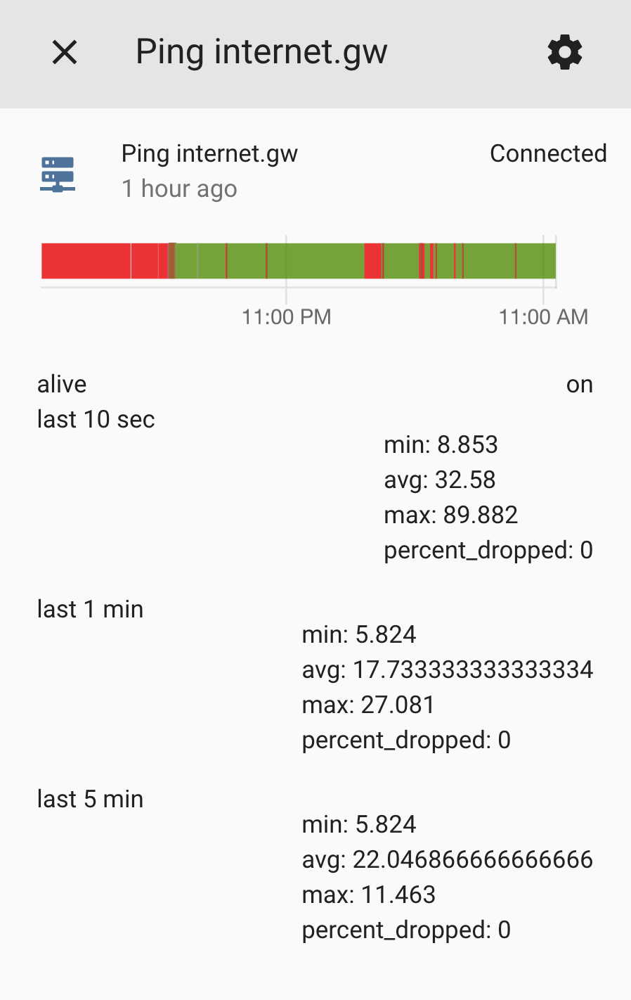

# ping2mqtt - Deliver latency information over mqtt.

This program will continuously ping one or more hosts and report stats every 10 seconds. It keeps a rolling 10 second, 1 minute, and 5 minute average. It publishes Home Assistant MQTT autodiscovery information so that you can access this data from HA.

# Running

Use docker to launch this. A typical invocation is:

    docker run --network mqtt -e MQTT_HOST=mosquitto -e HOSTLIST=localhost:127.0.0.1,router.local:192.168.1.1,internet.gw:10.10.10.1 skullydazed/ping2mqtt

You can also use docker compose:
```yaml
version: '3'
services:
  ping2mqtt:
    container_name: ping2mqtt
    image: skullydazed/ping2mqtt
    environment:
    - HOMEASSISTANT_PREFIX=homeassistant
    - HOSTLIST=router.local:192.168.1.1,internet.gw:10.10.10.1
    - MQTT_CLIENT_ID=ping2mqtt
    - MQTT_USER=username
    - MQTT_PASSWD=password
    - MQTT_HOST=mosquitto
    - MQTT_PORT=1883
    - MQTT_TIMEOUT=300
    - MQTT_TOPIC_PREFIX=ping
    - MQTT_QOS=1
    restart: always
```

# Configuration

You can use environment variables to control the behavior.

| Variable | Default | Description |
|----------|---------|-------------|
| `DEBUG` | | Set to `1` to enable additional debug logging. |
| `HOMEASSISTANT_PREFIX` | `homeassistant` | The prefix for Home Assistant discovery. Must be the same as `discovery_prefix` in your Home Assistant configuration. |
| `HOSTLIST` | `localhost:127.0.0.1` | A comma separated list of hosts to ping. This is the valid grammar for each host entry: `<hostname[:ip_address]>` |
| `MQTT_CLIENT_ID` | `mqtt2discord` | The client id to send to the MQTT broker. |
| `MQTT_USER` | `` | The user to send to the MQTT broker. Leave unset to disable authentication. |
| `MQTT_PASSWD` | `` | The password to send to the MQTT broker. Leave unset to disable authentication. |
| `MQTT_HOST` | `localhost` | The MQTT broker to connect to. |
| `MQTT_PORT` | `1883` | The port on the broker to connect to. |
| `MQTT_TIMEOUT` | `300` | The timeout for the MQTT connection. |
| `MQTT_TOPIC_PREFIX` | `ping` | The MQTT topic prefix. With the default data will be published to `ping/<hostname>`. |
| `MQTT_QOS` | `1` | The MQTT QOS level |

# Consuming The Data

Data is published to the topic `ping/<hostname>` using JSON serialization. It will arrive every ~10 seconds in the following form:

```yaml
{
    "alive": "on",
    "last_10_sec": {"min": 8.175, "avg": 32.592, "max": 136.915, "percent_dropped": 0.0},
    "last_1_min": {"min": 7.202, "avg": 25.959166666666665, "max": 23.103, "percent_dropped": 1.6666666666666714},
    "last_5_min": {"min": 6.87, "avg": 49.44593333333333, "max": 23.103, "percent_dropped": 2.0}
}
```

* `alive`: Set to `on` when the host is up, otherwise `off`
* `last_10_seconds`: An average of the last 10 datapoints we received
* `last_1_min`: An average of the last 6 `last_10_seconds` averages
* `last_5_min`: An average of the last 30 `last_10_seconds` averages

# Home Assistant

After you start the service binary sensors should show up in Home Assistant pretty immediately. Look for sensors that start with `binary_sensor.ping`. The latency information will be available as attributes, which you can then expose using template sensors if you wish. Be aware that the attributes are updated every 10 seconds, you will quickly fill your history db if you do not exclude your template sensors.


